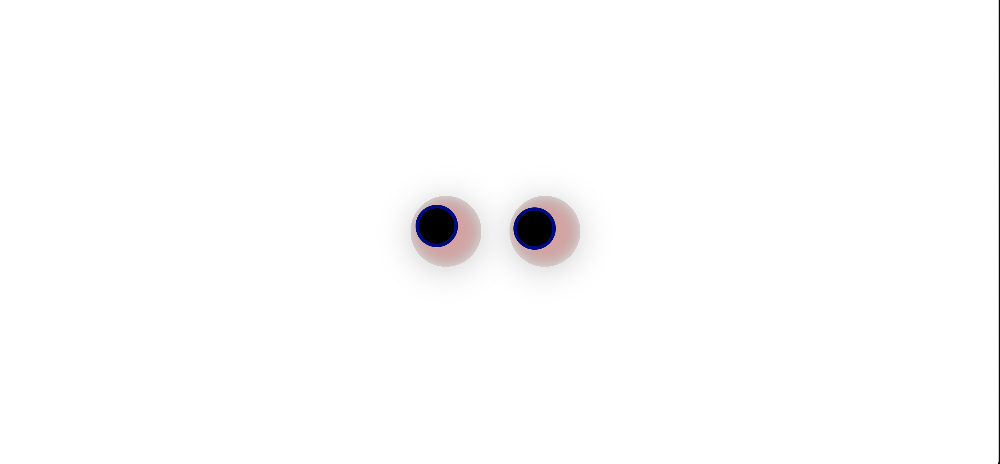

# Eye Tracker 👀

This is a fun and interactive Eye Tracker project built with **HTML, CSS, and JavaScript**. It simulates a pair of eyes that follow your mouse movement across the screen.




## 🔧 Features

- Dynamic eye movement that tracks the mouse cursor
- Smooth animation using JavaScript and CSS
- Clean and minimal UI design
- Fully responsive across screens

## 🚀 Technologies Used

- HTML5
- CSS3
- JavaScript (DOM Manipulation)

## 🧠 How it works

1. Two circular eyes are created using HTML and styled with CSS.
2. JavaScript listens to the `mousemove` event on the page.
3. Based on the cursor’s coordinates, each eye rotates in the direction of the cursor.

## 📁 Project Structure

## 📸 Demo

Open `index.html` in any browser to see the animation live!

## 🌟 Author

**Shivam Prajapati**  
Feel free to ⭐️ the repo and contribute if you'd like!

---

### 📝 How to Use this `README.md`

1. Save the above content in a file called `README.md` in your project root.
2. Make sure the screenshot file name is exactly the same (`Screenshot 2025-07-15 at 12.13.36 PM.png`) and placed in the same folder.
3. Then run the following Git commands in terminal:

```bash
git add README.md
git commit -m "Add README with project description and screenshot"
git push
git add README.md
git commit -m "Add screenshot preview to README"
git push


